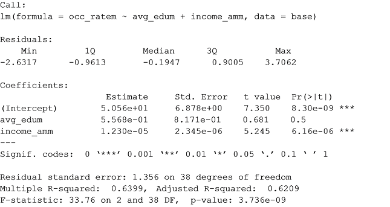
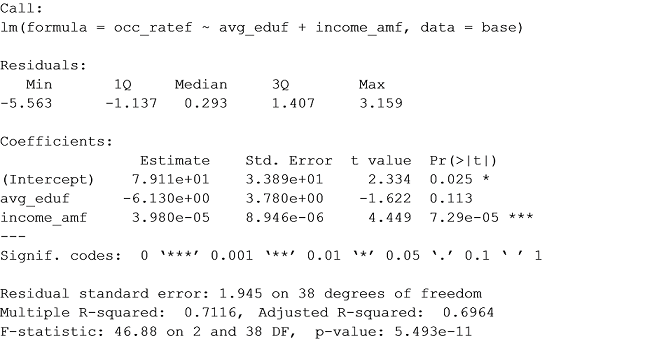

## Incidencia de la educación y el nivel de ingresos en la participación laboral

### 1. Especificación de los modelos
Con el objetivo de entender los determinantes de la participación laboral de las mujeres en el mercado laboral colombiano, se realizan dos modelos econométricos que se centran en el análisis del nivel educativo y el rango de ingresos según sexo como variables dependientes de la tasa de ocupación; por medio de la estimación de dos modelos econométricos que toman datos de las 13 áreas metropolitanas principales de Colombia establecidas por la Gran Encuesta Integrada de Hogares (GEIH) del DANE. 

El trabajo investigativo recae en la observación del comportamiento de las variables en el rango contemplado entre I-2007 a I-2017. Para la especificación del modelo se utilizará el método de Mínimos Cuadrados Ordinarios con el objeto de encontrar los parámetros de la ecuación de regresión lineal (β1, β2). Se parte de la base empírica:

h1 = Relación positiva del nivel educativo, a mayor nivel educativo mayor posibilidad de hacer parte de la población económicamente activa en el mercado laboral.

h2 = Relación positiva del nivel de ingreso, indicando que a mayor nivel de ingreso existe mayor posibilidad de hacer parte de la población económicamente activa en el mercado laboral, pues existen mayores incentivos a pertenecer empleado en determinada actividad.

El conjunto de datos contiene 287 observaciones y 7 variables, a partir de los cuales se construirán dos sub grupos de datos que contienen la misma información, pero segmentada según sexo (femenino - masculino) para realizar el análisis comparativo correspondiente. Las variables son:

	“periodicity”, contiene la periodicidad de la muestra, la cual es trimestral.
	“avg_edu”, promedio de población ocupada según nivel educativo. 
	“income_am”, promedio de ingresos laborales mensuales.

### 2. Análisis Exploratorio de los Datos

#### 2.1 Correlación, dispersión y normalidad
Los dos modelos se realizarán de forma simultánea, no obstante, para fines prácticos el modelo 1 contendrá los datos del modelo masculino y el modelo 2 los datos del modelo femenino. Se usa el método del test de Pearson para comprobar la correlación de las variables y también se utiliza un método de análisis visual.

Del análisis preliminar del modelo 1, se puede extraer que las variables dependientes tienen una buena relación lineal con la tasa de ocupación: nivel educativo (r = 0.61), ingreso (r = 0.79). También se puede observar una buena dispersión de las variables y una distribución normal con la posible presencia de valores atípicos.

Del análisis preliminar para el modelo 2, es posible determinar que las variables dependientes tienen una buena relación lineal respecto a la tasa de ocupación: nivel educativo (r = 0.75), ingreso (r = 0.83). La dispersión es adecuada y las variables se distribuyen de forma normal.

#### 2.2	Cambio Estructural
Con el fin de imitar la concurrencia de errores predictivos. Se comprueba la no presencia de cambio estructural, según el test Cusum.

### 3.	Modelos de Regresión Lineal Múltiple

#### 3.1. Modelo 1: Caso Masculino
El modelo con todas las variables introducidas como predictores tiene un R2 media - alta (0.64) por lo que es capaz de explicar el 64% de la variabilidad de la tasa de ocupación. El p-value del modelo es significativo (3.736e-09) lo cual significa que se puede aceptar que el modelo no está dado por azar; uno de los coeficientes parciales de regresión no es significativo lo que es un indicativo de que podría no contribuir al modelo.

Con el mismo nivel de significancia de 95% se determina que en el caso masculino la variable avg_edum (educación) es significativa dentro de este intervalo, el resultado obtenido corrobora que el nivel de educación no afecta negativamente la demanda ni la ocupación laboral para los hombres, pues afecta de forma positiva, en 0.56 veces su acceso al mercado de trabajo.
Con respecto al nivel de significancia de las variables independientes, para la prueba T se encuentra que ingreso promedio de los hombres (income_amm) es significativo individualmente con un nivel de confianza de 5%, infiriendo que los hombres que cuentan con un nivel de ingresos más alto son 0,0000123 veces más dados a permanecer en el mercado laboral, lo que corrobora la hipótesis planteada inicialmente, sin embargo, no en un porcentaje significativo.

#### 3.1.2. Intervalos de Confianza
Es posible determinar con estos intervalos que, con una confianza del 95%, la intersección se encuentra entre 36.63 y 64.48. Una vez más se encuentra que es muy poco probable que el verdadero valor sea 0. Se confirma el nivel de significancia bajo de la variable ingreso.

### 3.2. Modelo 2: Caso Femenino
El modelo con todas las variables introducidas como predictores tiene un R2 alta (0.71) por lo que es capaz de explicar el 71% de la variabilidad de la tasa de ocupación. El p-value del modelo es significativo (5.493e-11) con lo que se puede descartar que el modelo este dado por azar, uno de los coeficientes parciales de regresión no es significativo, lo que es un indicativo de que podría no contribuir al modelo.

)

El predictor educación (avg_edum) no es significativo bajo este intervalo, lo que quiere decir que no corresponde a la hipótesis propuesta inicialmente y por tanto el nivel de educación afecta negativamente la ocupación de las mujeres. De acuerdo a los resultados, un nivel educativo más alto para una mujer disminuye sus posibilidades de acceder al mercado laboral en 6.13 veces; coeficiente que sí coincide con la problemática que aborda el problema de investigación, pues a pesar de que las mujeres cuentan con un nivel educativo más alto que los hombres en la actualidad, esto no influye directamente en sus posibilidades de acceder al mercado laboral.
Se infiere que mujeres con un nivel de ingreso más alto son 0.0000398 veces más propensas a permanecer insertadas en el mercado laboral, lo que corrobora la hipótesis planteada inicialmente que indica que entre más alto sea el rango de ingreso percibido por las mujeres existe mayor probabilidad de participación laboral, sin embargo, es un valor poco significativo.

#### 3.2.2. Intervalos de Confianza
Es posible determinar con estos intervalos que, con una confianza del 95%, la intersección se encuentra entre 10.49 y 147.72. Los intervalos de confianza para la variable educación están entre -13.78 y 1.52. E igual que con el modelo 1 se verifica el nivel de significancia bajo de la variable ingreso. La distancia en la estimación ingreso del modelo 1 y 2 son inestables lo que se confirmaría con las pruebas de colinealidad.

### 4.	Verificación de Supuestos

#### 4.1 Linealidad
Se calcula la relación lineal entre los predictores numéricos y los residuos del modelo. En el caso masculino los residuos se distribuyen aleatoriamente en torno a cero con una variabilidad constante, pero se percibe la posible existencia de un valor atípico en la variable educación. Se realiza una nueva gráfica que incluya la variable “periodicidad” para determinar en qué espacio temporal se ubica el valor atípico y analizarlo.

